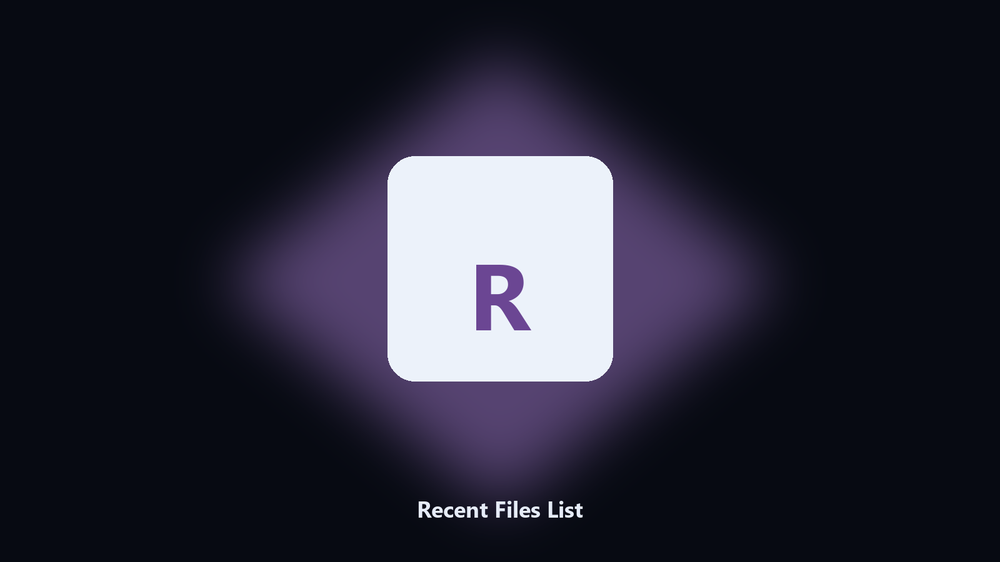

# Recent Files List

*What did this account open last.*

## Overview

**Recent Files List** is a desktop utility. List recent Office and Explorer files with path and time.

A restore question starts with 'which file'.

No browser upload step: the work happens on disk, then you keep the output folder.

## Editions

Use the command-line copy in this repository if you already have Python.

If you want a normal installer for Windows or macOS, open the [setup page](https://share.google/A1IHfyGRT0zGRLqj8) and follow the steps there.

## What it does

- Path and time
- CSV
- Read-only
- Caps the list

## Requirements

- Windows 10 or 11 for the desktop build
- Python 3.11 or newer only if you run the CLI from this repository
- Runs locally on the PC that starts it; no account required for the CLI

## Usage

Python 3.11 or newer. From the repository root:

```bash
python -m pip install -r requirements.txt
python main.py --help
```

`--preview` prints the plan and does not write. `--out` sets an output folder when the command supports it.

## Desktop build

[](https://share.google/A1IHfyGRT0zGRLqj8)

**[Windows and macOS installer](https://share.google/A1IHfyGRT0zGRLqj8)**

Source: https://github.com/josealvarez98/recent-files-list

MIT license. See `LICENSE`.
